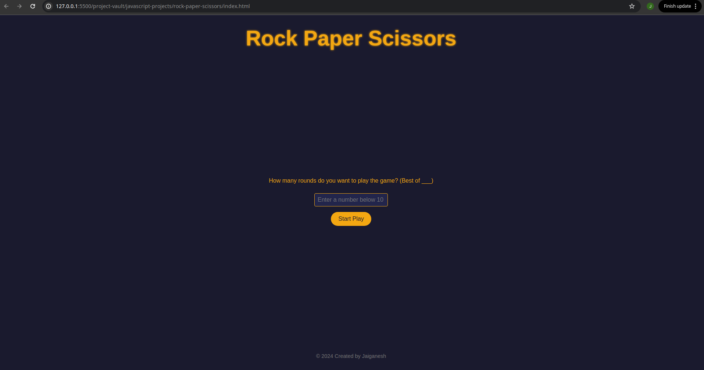
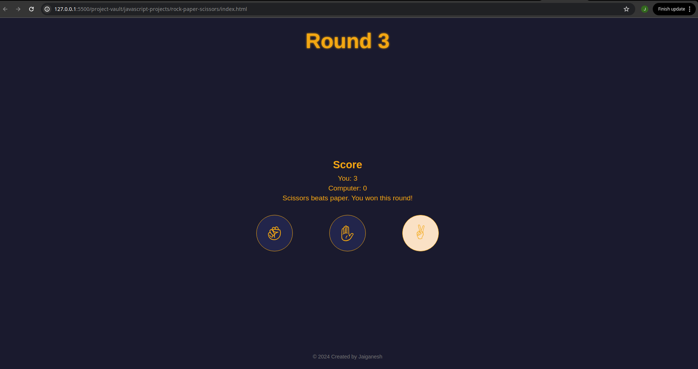
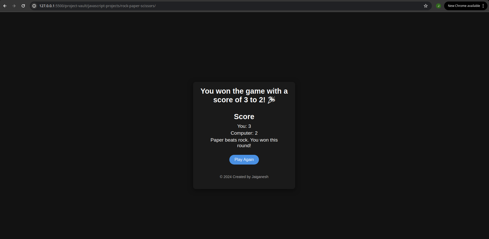

# Rock Paper Scissors Game

Welcome to the Rock Paper Scissors game! This is a simple web-based game where you can challenge the computer in a classic game of Rock, Paper, Scissors.

## Live Demo

[Play the Game](https://play-rock-paper-and-scissors.netlify.app/)


## Table of Contents

- [Features](#features)
- [Getting Started](#getting-started)
- [How to Play](#how-to-play)
- [Technologies Used](#technologies-used)
- [Screenshots](#screenshots)

## Features

- Play against the computer.
- Choose the number of rounds for the game (Best of X).
- Score tracking for both the player and the computer.
- Play again option after each game.

## Getting Started

### Prerequisites

- A web browser (Chrome, Firefox, Safari, etc.)

### Installation

1. Clone the repository or download the ZIP file.
2. Open the `index.html` file in your web browser to start playing.

### File Structure

```
javascript-projects/
└── rock-paper-scissors/
    ├── Favicon/
    ├── index.html
    ├── script.js
    ├── style.css
    ├── site.webmanifest
    ├── README.md
    └── Screenshots/
        ├── Screenshot_1.png
        ├── Screenshot_2.png
        └── Screenshot_3.png

```

## How to Play

1. Enter the number of rounds you want to play (must be below 10).
2. Click the "Start Play" button.
3. Choose Rock, Paper, or Scissors by clicking the corresponding button.
4. The game will display the result of each round and keep track of the scores.
5. Once the designated rounds are completed, the game will announce the winner and provide an option to play again.

## Technologies Used

- HTML
- CSS
- JavaScript

## Screenshots

### Game Screenshot 1



### Game Screenshot 2



### Game Screenshot 3


